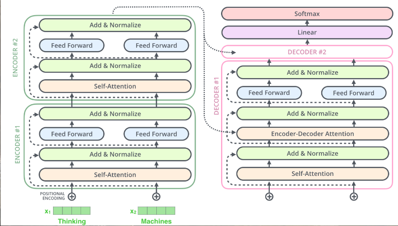

# BotTown


****instructions:   
-It must contain a nice notebook walking through the code of your project.  
-Any code/scripts/models written/developed for the project.  
-Slides for your presentation.  
-A ReadMe that is 1) neat 2) clearly explains the project, the goal, and the outcome 3) has at least one visualization/picture of some kind.   

-----

Contributors: Christopher Pang, Jeffery Ott

We built a town of generative chatbots that have fantasy conversations about Dungeons and Dragons (DnD). We hope that this project will stimulate further interests in building conversational AI systems that one day can play DnD alongside people.


If we take a look at some sample conversations, there are some entertaining conversations:

```
Prompt  Oh no. 
SAM: Oh no! 
SAM: (laughs) 
TALISON: It's just a little bit of fun. 
TRAVIS: I don't know if I can do that.  
TRAVIS: We'll find out.  It's not like I'm going to be able to do that, right? 
TALISON: I don't think that's the case. 
SAM: Yeah, but if you're going to do it, you can't do it on a boat.  
MATT: But if you want to do that, you could do it in a boat and then-- 
TRAVIS: Yeah, but you have to be in the water to do it. 
TRAVIS: I mean, you can do it on a boat.  
```

. 
[Image credits](https://towardsdatascience.com/make-your-own-rick-sanchez-bot-with-transformers-and-dialogpt-fine-tuning-f85e6d1f4e30)

Modified code from [here](https://towardsdatascience.com/make-your-own-rick-sanchez-bot-with-transformers-and-dialogpt-fine-tuning-f85e6d1f4e30)

