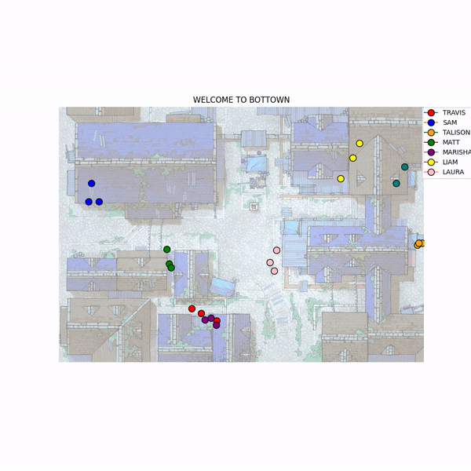

# BotTown

-----

Contributors: Christopher Pang, Jeffery Ott

Our goal: We built a town of generative chatbots that have fantasy conversations about Dungeons and Dragons (DnD). We hope that this project will stimulate further interests in delving deeper into natural language processing (NLP)/Seq2Seq modeling techniques and building conversational AI systems that one day can play DnD alongside people.

Each bot is trained on a different character corpus. During the “day” the bots move randomly around the “town” and have conversations whenever they interact, these conversations are stored.


## Repository
This repository contains notebooks for  training the transformer model (`notebooks/BotTown.ipynb`) and making inferences on the model (`notebooks/Botown_village.ipynb`). We also include the `data` used and presentation `slides` associated with this project.

   

https://drive.google.com/drive/folders/1R_WZYQ5BsGPTlSrm_g6Inwph8xZw0Bpq?usp=sharing

## Data
We downloaded and processed the Critical Role transcript podcast text data from [here](https://criticalrole.fandom.com/wiki/Transcripts). Critical Role is an American web series in which a group of professional voice actors play Dungeons & Dragons.  `data/train.csv` contains the compiled transcript data in a csv format. The csv rows are ordered and have the columns Dungeon Master (DM), question, Player, Response. Further preprocessing is done to get the data into 5 historical context and response format.

## Model
We used the Hugging Face transformers library and used transfer learning from Microsoft’s Large-scale Pretrained Response Generation Model (DialoGPT) that has been pretrained on 147M dialogue from Reddit. The model is based on the GPT-2 model.

   
[Image credits](https://towardsdatascience.com/make-your-own-rick-sanchez-bot-with-transformers-and-dialogpt-fine-tuning-f85e6d1f4e30)

We then fine tuned each player model on 5 historical context and 1 response, which was from 900k lines of Critical Role podcast.   

## Results
If we take a look at a sample conversation, there is some entertaining, engaging dialogue between player chatbots:
### Sample generated conversation #1

```
Prompt  Can you make me an explosive axe?
LIAM: I'm not going to do that.
TRAVIS: You can't do that, you're going to have to roll an attack.
LIAM: That's a 19.
MATT: Okay. You swing wide, and as you do, you see the blade streak across the back of its neck   
and you can see the blood begin to pour out of its wound. It's bleeding profusely.
SAM: Oh, it's bleeding?
TALISON: It's just a little bit.
SAM: I'm going to use the other one.
LIAM: All right.
TALISON: That's a natural 20.
SAM: I'm going to try to hit the thing that's holding me.
TALISON: Okay. You're going to hit it?
```

### Sample generated conversation #2
```
Prompt  Oh no. 
SAM: Oh no! 
SAM: (laughs) 
TALISON: It's just a little bit of fun. 
TRAVIS: I don't know if I can do that.  
TRAVIS: We'll find out.  It's not like I'm going to be able to do that, right? 
TALISON: I don't think that's the case. 
SAM: Yeah, but if you're going to do it, you can't do it on a boat.  
MATT: But if you want to do that, you could do it in a boat and then-- 
TRAVIS: Yeah, but you have to be in the water to do it. 
TRAVIS: I mean, you can do it on a boat.  
SAM: Yeah, but you can't do it underwater.  There's no--
```


### Sample generated conversation #3
   

Here we demonstrate diffusion of knowledge: When Marisha (purple) "runs into" Travis (red), Marisha tells Travis (red) about Patient Defense. When Travis "runs into" Matt (green), then in the next conversation, Travis tells Matt about Patient Defense.


```
TRAVIS-MARISHA Conversation
TRAVIS: We're going to get the f*** out of here.
MARISHA: Oh my god.
TRAVIS: You're going in the water?
MARISHA: I'm going to swim in the lava.
TRAVIS: Okay.
MARISHA: And I'm gonna swim in lava. I'm just going to float in the water.
TRAVIS: I'm going to swim in the lava.
MARISHA: Okay.
TRAVIS: (whispering) Let's go.
MARISHA: All right.
TRAVIS: What?
MARISHA: You know, I'm not sure.
TRAVIS: Oh, that's good.
MARISHA: That's good, that is good. That's a natural 20.
TRAVIS: Yeah, that hits.
MARISHA: And then I'm going to do Patient Defense.
TRAVIS: Okay.
MARISHA: I'm gonna do Patient Def.
_______________________________________
TRAVIS-MATT Conversation
TRAVIS: Patient Defense, I'm going for it.
MATT: Okay, so Patient Defense.
TRAVIS: I'm not going to roll for that.
MATT: All right, so, Patient Defense, that's your action.
TRAVIS: Patient Defense.
MATT: That's your movement.
TRAVIS: Yeah, I'll move up to the other side of the room.
MATT: Okay.
TRAVIS: I'll go to the door.
MATT: All right.
TRAVIS: What's the matter with you?
MATT: I don't know.
TRAVIS: We're not here to judge.
MATT: Oh, we're not?
```

## Credits
Modified code from [here](https://towardsdatascience.com/make-your-own-rick-sanchez-bot-with-transformers-and-dialogpt-fine-tuning-f85e6d1f4e30)

