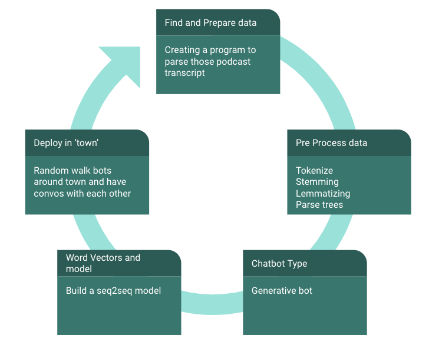
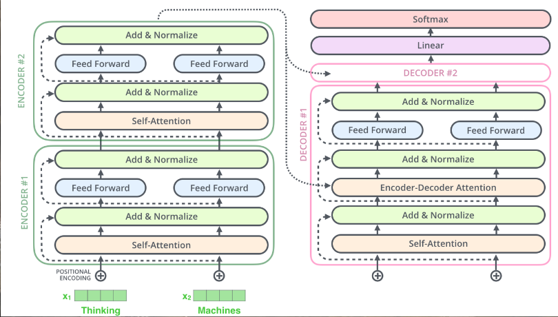
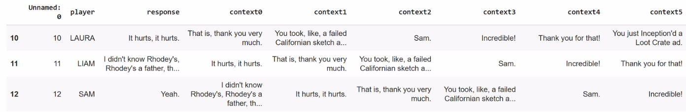

# BotTown


# ****instructions to delete:   
-It must contain a nice notebook walking through the code of your project.  
-Any code/scripts/models written/developed for the project.  
-Slides for your presentation.  
-A ReadMe that is 1) neat 2) clearly explains the project, the goal, and the outcome 3) has at least one visualization/picture of some kind. 
# delete up to here  

-----

Contributors: Christopher Pang, Jeffery Ott

Our goal: We built a town of generative chatbots that have fantasy conversations about Dungeons and Dragons (DnD). We hope that this project will stimulate further interests in delving deeper into natural language processing (NLP)/Seq2Seq modeling techniques and building conversational AI systems that one day can play DnD alongside people.

Each bot is trained on a different character corpus. During the “day” the bots move randomly around the “town” and have conversations whenever they interact, these conversations are stored.


## Repository
This repository contains notebooks for  training the transformer model (`notebooks/BotTown.ipynb`) and making inferences on the model (`notebooks/Botown_village.ipynb`). We also include the `data` used and presentation `slides` associated with this project.

   

## Data
We downloaded and processed the Critical Role transcript podcast text data from [here](https://criticalrole.fandom.com/wiki/Transcripts). Critical Role is an American web series in which a group of professional voice actors play Dungeons & Dragons.  `data/train.csv` contains the compiled transcript data in a csv format. The csv rows are ordered and have the columns Dungeon Master (DM), question, Player, Response. Further preprocessing is done to get the data into 5 historical context and response format.

## Model
We used the Hugging Face transformers library and used transfer learning from Microsoft’s Large-scale Pretrained Response Generation Model (DialoGPT) that has been pretrained on 147M dialogue form Reddit. The model is based on the GPT-2 model.

   
[Image credits](https://towardsdatascience.com/make-your-own-rick-sanchez-bot-with-transformers-and-dialogpt-fine-tuning-f85e6d1f4e30)

We then fine tuned each player model on 5 historical context and 1 response, which was from 900k lines of Critical Role podcast.   

## Results
If we take a look at a sample conversation, there is some entertaining, engaging dialogue between player chatbots:

```
Prompt  Oh no. 
SAM: Oh no! 
SAM: (laughs) 
TALISON: It's just a little bit of fun. 
TRAVIS: I don't know if I can do that.  
TRAVIS: We'll find out.  It's not like I'm going to be able to do that, right? 
TALISON: I don't think that's the case. 
SAM: Yeah, but if you're going to do it, you can't do it on a boat.  
MATT: But if you want to do that, you could do it in a boat and then-- 
TRAVIS: Yeah, but you have to be in the water to do it. 
TRAVIS: I mean, you can do it on a boat.  
SAM: Yeah, but you can't do it underwater.  There's no--
```


Modified code from [here](https://towardsdatascience.com/make-your-own-rick-sanchez-bot-with-transformers-and-dialogpt-fine-tuning-f85e6d1f4e30)

